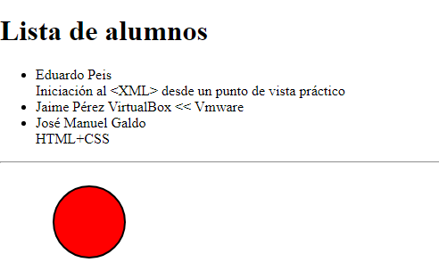

###### *Lenguajes de Marcas - Curso 2022/2023 - IES Leonardo da Vinci - Alberto Ruiz*
## B2P04 - Espacios de nombres

*Antes de comenzar: revisa la teoría de espacios de nombre en los dos archivos de apuntes proporcionados, y los ejemplos de espacios de nombre 1 y 2.*

Se incluye un archivo XML con el mismo nombre de este documento. Antes de empezar corrige los posibles errores que pueda tener.

El objetivo del ejercicio es modificar el código para que se muestre como en la figura. Para ello debes utilizar únicamente **espacios de nombres**, indicando así al procesador que algunas etiquetas deben interpretarse como XHTML, y que el elemento círculo se debe interpretar de acuerdo a la gramática de SVG (Scalable Vector Graphics, un lenguaje de descripción de gráficos vectoriales).

Espacios de nombres necesarios:

*http://www.w3.org/1999/xhtml*

*http://www.w3.org/2000/svg*

Resuelve el problema combinando las dos formas de gestionar espacios de nombres:

* Para las etiquetas XHTML define al comienzo del documento un prefijo “web” que indique que cada vez que un elemento lleve ese prefijo, deberá interpretarse de acuerdo a la gramática XHTML.

* Para SVG indícalo directamente en el elemento a través del atributo xmlns

Al visualizar el archivo XML en un navegador, el resultado será este:

