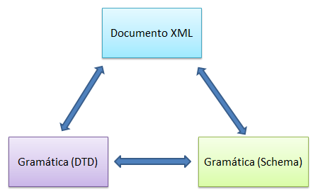

###### *Lenguajes de Marcas - Curso 2022/2023 - IES Leonardo da Vinci - Alberto Ruiz*

## B2P07 - XML, DTD, Schema

Una vez estudiados los documentos XML y las dos formas de expresar sus gramáticas (DTD y Schema), deberías ser capaz de realizar cualquiera de estas tareas:

* Dado un documento XML, generar una gramática expresada en DTD o esquema
* Dada una gramática expresada en DTD o esquema, escribir un documento XML que la cumpla
* Dada una gramática expresada en DTD, generar un esquema equivalente (o al revés)

Este último paso (de esquema a DTD) es el único que no hemos probado, y lo haremos en esta última actividad.

**Apartado 1: Generar una gramática (como esquema) y un documento XML válido** 

*Comentario previo: cuando se pide un esquema y un documento válido, puedes elegir en qué orden hacerlo. Lo lógico sería comenzar por la gramática: sin embargo, a veces resulta más sencillo comenzar a escribir un documento de ejemplo y, a partir de él, describir la gramática.* 

Se pide generar un esquema para describir un sistema de préstamo de videojuegos. Ejemplos de campos de videojuegos:

·     Código: V_1

·     Título: The Last of Us II

·     Desarrollado por Naughty Dog

·     País de origen: Estados Unidos

·     Año: 2020

·     Género: Acción, Aventura, Terror

·     Plataformas: PlayStation 

·     Código: V_2

·     Título: Hollow Knight

·     Desarrollado por Team Cherry

·     País de origen: Australia

·     Año: 2017

·     Género: Plataformas, Metroidvania

·     Plataformas: PC, PlayStation, Xbox, Switch

Debes describir también usuarios, por ejemplo:

·     Nombre de usuario: jlopez

·     Nombre: Julia López

·     Teléfono: 55512345

Por último, debes describir los **préstamos** de videojuegos realizados a usuarios, que deben incluir la fecha de préstamo.

**Apartado 2: Traducir el esquema a DTD** 

*Comentario previo: se aconseja solicitar al profesor que revise el apartado 1 antes de comenzar este segundo apartado.*

Una vez tengas el documento XML y la gramática en esquema XML, ahora debes generar una DTD equivalente.

Ten en cuenta que puede haber aspectos que no puedas reflejar en la DTD debido a su menor potencia expresiva. En este caso se pide indicar los aspectos que se hayan podido perder, en forma de comentario XML.

**Forma de entrega:**

Un único documento en el que se incluyan bien separados e identificados con títulos: 

* El archivo XML que has generado
* Su gramática XSD asociada
* Un nuevo archivo XML con su DTD asociada (puede ir en uno o dos archivos)
