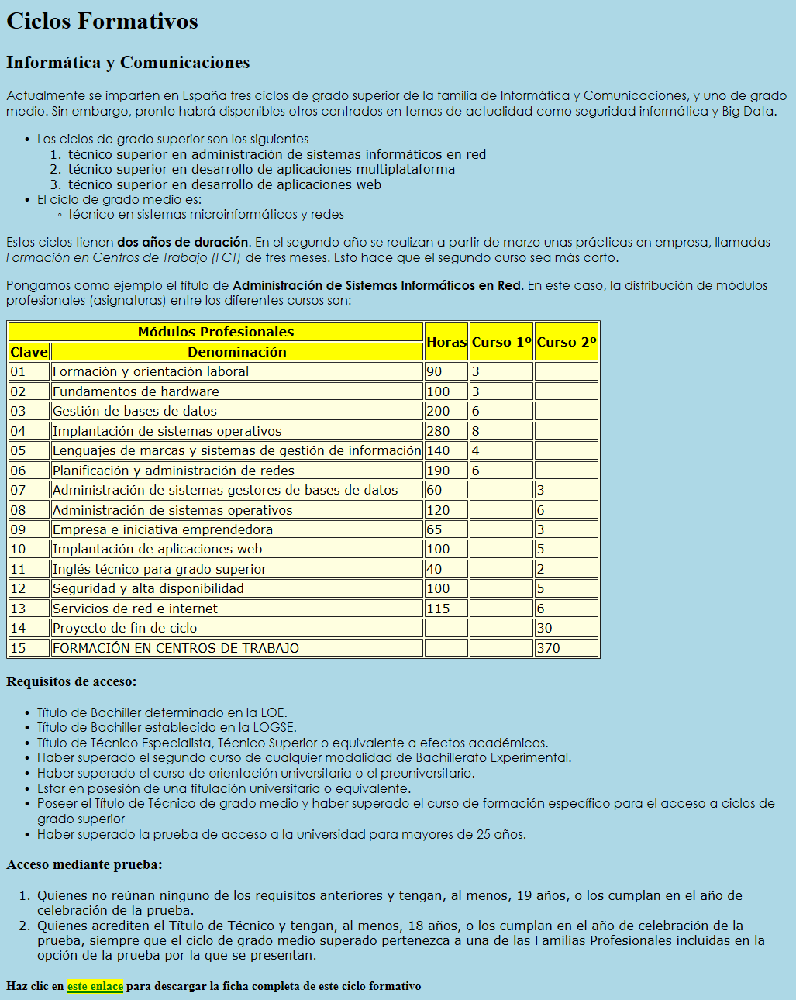

###### *Lenguajes de Marcas - Curso 22/23 - IES Leonardo da Vinci - Alberto Ruiz*
## B1P11 - Atributos de texto y listas

##### Primera parte

En esta práctica partiremos de una página web y le añadiremos reglas de estilos para modificar su aspecto.

Antes de nada, examina el archivo “B1P11.html” con el que vas a trabajar, y observa que se incluye un archivo de imagen “B1P11-tick.png”.

##### Primera parte: reglas generales

Las siguientes reglas CSS deberán estar en la cabecera, dentro del elemento `<style>`:

1. El tipo de letra utilizado en párrafos y listas sin orden será “Century Gothic”

2. El tipo de letra utilizado en tablas y listas con orden será “Verdana”

3. Los enlaces…

* Tanto los visitados como los no visitados aparecerán en color verde sobre fondo amarillo

* Cuando pasemos el ratón sobre un enlace, se mostrará amarillo con fondo verde

4. Las tablas tendrán fondo color lightyellow

5. Las celdas de cabacera tendrán fondo amarillo

Tras aplicar las reglas, el aspecto de la página será como en la figura:

##### Segunda parte: reglas particulares 

Las siguientes reglas se aplicarán directamente al elemento afectado, con el atributo style:

6. El título “Informática y Comunicaciones” se mostrará con la fuente de Google “Bree Serif”

7. El primer párrafo (*Actualmente…*) aparecerá subrayado, con interlineado doble, y una sangría de 40 píxeles

8. El párrafo “*Estos ciclos…*” aparecerá centrado

9. El título “Requisitos de acceso” aparecerá con un grosor más ligero de lo normal

**Cambios en la primera lista, la de ciclos:**

10. Aparecerán cuadrados como iconos de lista

**Cambios en la lista ordenada de ciclos de grado superior:**

11. El texto en esta lista aparecerá con una mayúscula inicial en cada palabra (usando CSS, sin modificar el código HTML

12. En vez de números, aparecerán números romanos en mayúscula

**Cambios en la lista sin orden de requisitos de acceso:**

13. Aparecerá el icono proporcionado con este enunciado (tick.png)

**Cambios en la tabla:** 

14. Se utilizará el estilo de borde único

15. La celda de Formación en centros de trabajo” aparecerá con fondo color coral

 

Tras aplicar las reglas, el aspecto de la página será como en esta figura:

#### Nota previa sobre la futura entrega de las prácticas:

Las prácticas de CSS se presentarán con el mismo formato que las de HTML, es decir, a través de un "index" principal que contendrá un iframe. Tenlo en cuenta a la hora de ir ubicando tus archivos. 

Sin embargo **desaconsejo** que trabajes durante todo el bloque con el iframe: no sólo será más incómodo probar aspectos como los márgenes, sino que ya habrás podido comprobar que al utilizar iframes es más incómodo actualizar las páginas cada vez que hacemos cambios.

