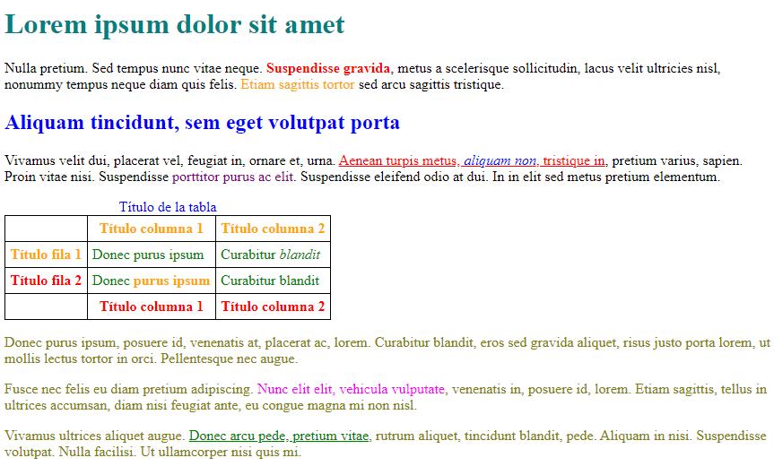

###### *Lenguajes de Marcas - Curso 2022/2023 - IES Leonardo da Vinci - Alberto Ruiz*

## B1P13 - Reglas con modelo

Abre el archivo y observa que se incluye una primera regla CSS que afecta a la tabla y no debes modificar.

Añade después las reglas adecuadas para que el resultado sea como este:

