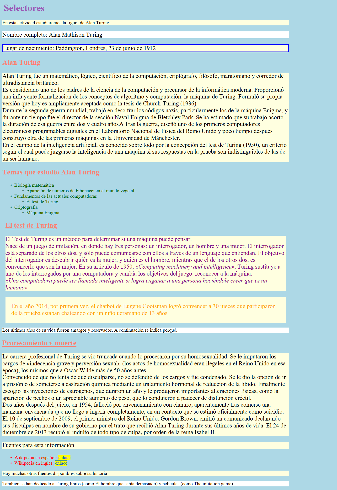

###### *Lenguajes de Marcas - Curso 2022/2023 - IES Leonardo da Vinci - Alberto Ruiz*

## B1P14 - Selectores avanzados

Abre el archivo HTML del mismo nombre y asocia el archivo CSS proporcionado mediante el código HTML necesario.

Ahora ve añadiendo una a una las reglas necesarias.

Para hacer esta práctica no es necesario un modelo, puesto que se pide de forma específica lo que se quiere conseguir, pero quedaría así:

