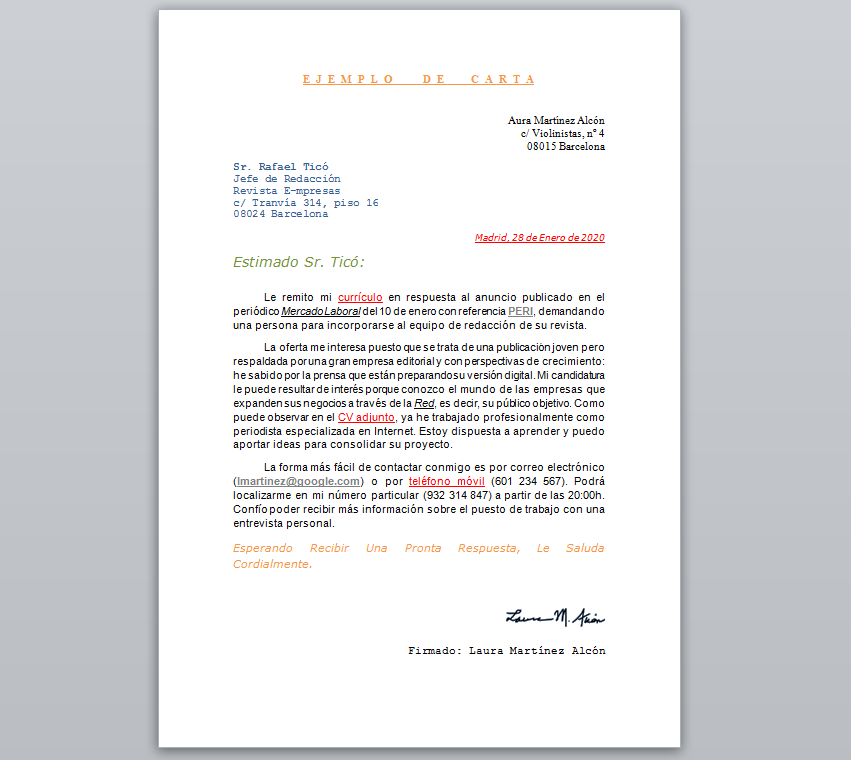

###### *Lenguajes de Marcas - Curso 2022/2023 - IES Leonardo da Vinci - Alberto Ruiz*
## B1P18 - Carta

Con esta práctica se incluye una página web. El objetivo es reproducir en HTML el aspecto de la siguiente imagen, incluyendo el fondo gris y el sombreado (puedes personalizar el color de fondo si quieres) .

**Todo el ejercicio debe resolverse únicamente en un archivo `B1P18.css`, sin modificar el archivo HTML original.** 

Se incluye también la imagen de la firma, que deberás ubicar en su espacio, pero utilizando únicamente CSS (piensa cómo se podría hacer)

